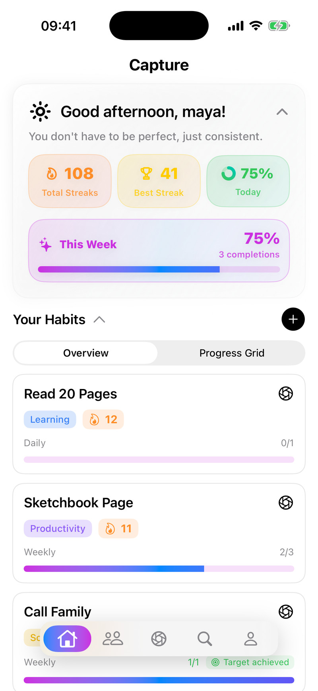
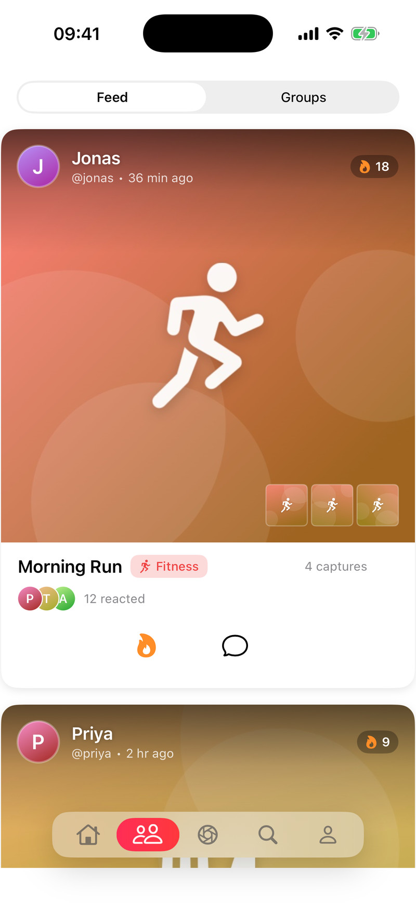
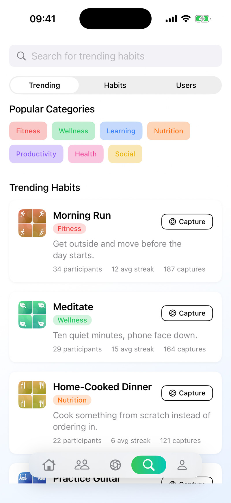
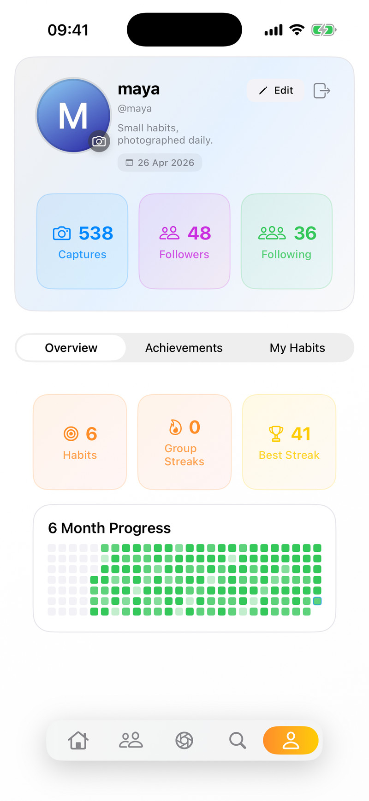

# Capture

A habit tracker for iOS where you complete a habit by taking a photo of it, with a social feed of other people's progress.

**Status:** Archived, kept for reference. Development stopped in August 2025 and the Supabase backend it talked to no longer exists, so the app now only runs in an offline demo mode (see [Running it](#running-it)).

<p align="center">
  
  
  
  
</p>

<p align="center"><sub>Screenshots are from the built-in demo mode. The people and numbers are sample data, and the "photos" are generated placeholder artwork.</sub></p>

## Why it exists

Most habit trackers are a checkbox, which is easy to tick without doing the thing. Capture was an experiment in making a photo the proof: the original spec describes it as a camera-first tracker in the spirit of BeReal, using a feed of friends' captures for accountability.

## What it does

- Track daily, weekly or monthly habits, each with a target count (for example three times a week).
- Mark a habit done by taking a photo with the in-app camera, or by picking and cropping one from the library. Captures can be public or private.
- See current streaks, today's and this week's completion, and a six-month progress grid.
- Browse a feed of other users' public captures, grouped per person and habit, and react to them or comment.
- Discover trending habits by category, adopt one with a tap, search for users and follow them.
- Edit your profile and avatar.

## Technical highlights

- **Streaks are computed on the device.** `HabitManager` buckets six months of captures by day, week and month and walks backwards to work out each habit's streak and whether the current period is complete, taking per-habit targets into account.
- **Habits are shared templates, not per-user rows.** The data model separates `habit_templates` from `user_habits`, so that everyone doing "Morning Run" points at the same template. That is what makes trending and discovery possible.
- **Trending is calculated in Postgres.** A view and an RPC function rank habits using the last seven days of captures, participants and likes, so the app fetches a ready-made list.
- **A custom image pipeline.** `ImagePreloader` keeps a size-limited in-memory cache, uses an actor to de-duplicate in-flight downloads, and generates small thumbnails for the trending grid.
- **Per-type response caching.** `AppCacheManager` stores habits, captures, categories and the feed with separate expiry times (five minutes for the feed up to a day for categories) so tabs open with data already present.

**Stack:** Swift, SwiftUI, AVFoundation, Supabase (Auth, Postgres, Storage) via [supabase-swift](https://github.com/supabase/supabase-swift).

Drafted with AI coding agents. The project was abandoned before the code had a thorough review, so read it as a prototype rather than reviewed work.

---

## Requirements

- Xcode with an iOS 18.5 or later simulator. The project was last built with Xcode 26.3.
- No other tools. The one dependency, supabase-swift 2.31.2, is resolved by Swift Package Manager when the project opens.

## Running it

The original backend is gone, so run the app in demo mode. Demo mode is compiled into Debug builds only. It signs in a sample user and serves fixture data and generated images locally, with no network access.

**From Xcode:** open `Capture.xcodeproj`, choose Product → Scheme → Edit Scheme → Run → Arguments, add `-demoMode` under "Arguments Passed On Launch", and run on a simulator.

**From the command line:**

```bash
xcodebuild -project Capture.xcodeproj -scheme Capture -configuration Debug \
  -destination 'platform=iOS Simulator,name=iPhone 17 Pro' \
  -derivedDataPath build CODE_SIGNING_ALLOWED=NO build
```

```bash
xcrun simctl boot "iPhone 17 Pro"
```

```bash
xcrun simctl install booted build/Build/Products/Debug-iphonesimulator/Capture.app
```

```bash
xcrun simctl launch booted com.bower.Capture -demoMode
```

Add `-demoTab <0-4>` to open on a particular tab (0 Home, 1 Feed, 2 Capture, 3 Discover, 4 Profile).

Demo mode is read-only. Anything that writes (saving a capture, following someone, commenting, adopting a habit) still tries to reach the old backend and fails.

### Running against your own backend

This is untested since the original project was lost. You would need to:

1. Create a Supabase project.
2. Copy `Capture/Supabase.example.plist` to `Capture/Supabase.plist` (git-ignored) and fill in the project URL and anon key.
3. Run `supabase/schema.sql` against the project. It was consolidated from the original iterative scripts and has never been run. The base tables were only ever created in the Supabase dashboard, so they are reconstructed from the app's models and marked `RECONSTRUCTED` in the file. Expect to fix things, and read the `NOTE:` comments first.

## Project structure

```
Capture/
  CaptureApp.swift          App entry point
  ContentView.swift         Auth gate, tab container and custom tab bar
  SupabaseManager.swift     Backend client; the calls are in SupabaseManager+*.swift,
                            split into Auth, Habits, Captures, Discovery and Social
  SupabaseConfig.swift      Reads the project URL and key from Supabase.plist
  AuthManager.swift         Session state
  HabitManager.swift        Habits, captures, streak and completion logic
  SocialManager.swift       Follows and follower lists
  AppCacheManager.swift     Response cache with per-type expiry
  ImagePreloader.swift      Image cache, preloading and thumbnails
  Models.swift              Codable models
  Theme.swift               Colours and shared styling
  Log.swift                 Error logging wrapper
  *View.swift               One file per screen
  CameraManager.swift       AVFoundation capture session
  Demo/DemoMode.swift       Debug-only demo mode and fixtures
supabase/schema.sql         Consolidated database schema (untested)
figma/                      React prototype of the same app, exported from Figma Make, and its spec
docs/images/                README screenshots
```

The three manager classes are singletons injected as environment objects. Views read their published state, and almost every network call goes through `SupabaseManager`, which is where demo mode swaps in fixtures. The exceptions are the follow, profile and habit-template queries in `SocialManager`, `AuthManager`, `HabitManager` and `UserProfileView`, which use the client directly and are not covered by demo mode.

## Tests

There are none.

## Known limitations

- The backend no longer exists, so only demo mode works, and the replacement schema is untested.
- The Groups tab in the feed and most of the Achievements tab are "coming soon" placeholders.
- There is no way to delete a habit.
- The camera tab needs a physical device, as the simulator has no camera.
- The camera code was reworked after the backend was lost and has only been compiled, not run on a device.

## Credits

- [supabase-swift](https://github.com/supabase/supabase-swift) for the backend client.
- The prototype in `figma/` was generated with Figma Make and includes [shadcn/ui](https://ui.shadcn.com/) components (MIT) and Unsplash photo references. See `figma/Attributions.md`.

## License

[MIT](LICENSE)
